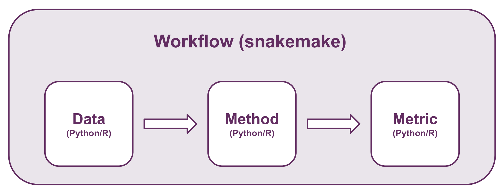

# Contribution guide

First off, thank you for considering contributing to the SpaceHack 2023 project!

Following these guidelines helps to communicate that you respect the time of the developers managing and developing this open source project. In return, they should reciprocate that respect in addressing your issue, assessing changes, and helping you finalize your pull requests.

SpaceHack 2023 is an open source project and we love to receive contributions from our community — you! There are many ways to contribute, from writing tutorials or blog posts, improving the documentation, submitting bug reports and feature requests or writing modules (for data, methods, metrics) that can be incorporated into SpaceHack 2023 itself.

# Getting started

Our workflow is set up to allow everyone to contribute "modules" in their preferred programming language (.. as long as that is either R or Python). A module can either be a dataset, a computational method, or an evaluation metric.

This repository contains some templates and examples of how to implement your module so that it interfaces seamlessly with other modules in the workflow. For example, if you want to implement a new method, you do not need to worry about input data or evaluation metrics as long as you follow the template for reading input and writing output - if you correctly adhere to the input and output guidelines, you should be able to interface with our default data modules and default evaluation metrics modules. The default modules are:

 - data: LIBD Visium DLPFC dataset (4 samples, each with 3 replicates)
 - methods: BayesSpace and SpaGCN
 - evaluation metrics: ARI and V_measure

 ## How to contribute a module

Module contribution will be managed via GitHub. The steps to contribute a module are:

1. Fork (or if you are part of the SpaceHack community branch) the latest version of the [SpaceHack repository](https://github.com/SpatialHackathon/SpaceHack2023)

2. Make a copy of a [template](./templates/) depending on whether you are implementing a data, method, metric, or consensus module. You can have a look at existing modules if you are unsure what to do.

3. Modify the files, filenames, and code in your copied template and move it to the correct module directory.

4. Test. Before you make a pull request make sure that you can run the default modules. If it is a dataset, try to run e.g. SpaGCN or BayesSpace (or any other implemented method). If you implemented a method, try to run it on a dataset, and then test your output with an existing method.

5. Create a [pull request](https://docs.github.com/en/pull-requests/collaborating-with-pull-requests/proposing-changes-to-your-work-with-pull-requests/creating-a-pull-request?tool=cli).

6. Wait for code review and your module being merged into the workflow.

Easy!

## How to report a bug

When filing an issue, make sure to answer these five questions:

1. What version of Go are you using (go version)?
2. What operating system and processor architecture are you using?
3. What did you do?
4. What did you expect to see?
5. What did you see instead?

## Feature requests

If you find yourself wishing for a feature or modules that don't exist in SpaceHack 2023, you are probably not alone. There are bound to be others out there with similar needs. Many of the features that SpaceHack 2023 has today have been added because our users saw the need. Open an issue on our issues list on GitHub that describes the feature you would like to see, why you need it, and how it should work.

## Code review process

The core team looks at Pull Requests on an ad-hoc basis. 
After feedback has been given we expect responses within four weeks. After four weeks we may close the pull request if it isn't showing any activity.

# Community

You can chat with the core team on [Slack](https://spacehack20.slack.com).

