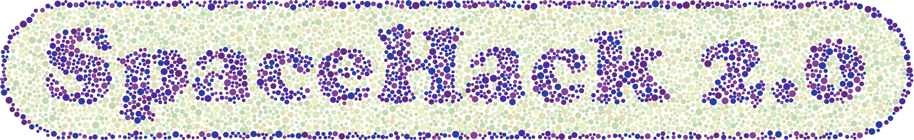

# SACCELERATOR

SACCELERATOR is the outcome of SpaceHack 2.0, a community-driven project to (not) benchmark domain identification methods for spatially-resolved transcriptomics data.

## SACCELERATOR - a flexible framework for applying spatially aware clustering methods

Spatial omics have transformed tissue architecture and cellular heterogeneity analysis by integrating molecular data with spatial localization. In spatially resolved transcriptomics, identifying spatial domains is critical for analysis of anatomical regions within heterogeneous datasets and understanding tissue function. Since 2020, more than 50 spatially aware clustering methods have been developed for this task. However, the reliability of existing benchmarks is undermined by their narrow focus on Visium and brain tissue datasets, as well as the dependence on questionable ground truth annotations. Here, we implemented a consensus framework that surpasses traditional benchmarking practices.

Our framework comprises a community-driven benchmark-like platform that streamlines data formatting, method integration, and metric evaluation while accommodating new methods and datasets. Currently, the platform includes 22 spatially aware clustering methods across 15 datasets spanning 9 technologies and diverse tissue types. The benchmark approach uncovered significant limitations in generalizability and reproducibility where methods that perform well on healthy tissues often falter on cancer samples. We also found that anatomical labels commonly used as ground truths are often biased, potentially error-prone, and in some cases, unsuitable for benchmarking efforts.

In light of these issues, we adopt a flexible expert-in-the-loop consensus-driven approach. This goes beyond traditional ensemble/consensus methods, and allows researchers to interact with intermediate results to determine which tools should be used to generate a consensus. We believe that the inclusion of an expert-in-the-loop is critical to ensure that the computational analysis matches the biological question at hand, and we believe that when the focus of the analysis is to uncover novel biological discoveries, tissue experts are accessible more often than not.

## Citation

If you are using SACCELERATOR please cite

> Sun, J. et al. Beyond benchmarking: an expert-guided consensus approach to spatially aware clustering. bioRxiv https://doi.org/10.1101/2025.06.23.660861 (2025).
